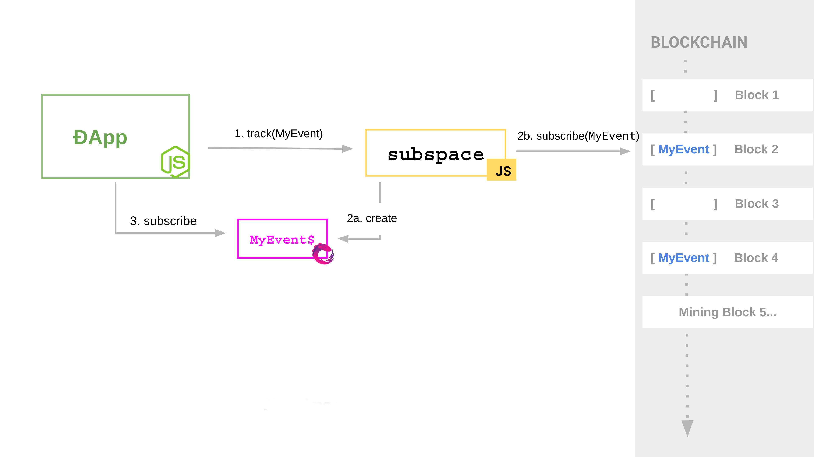
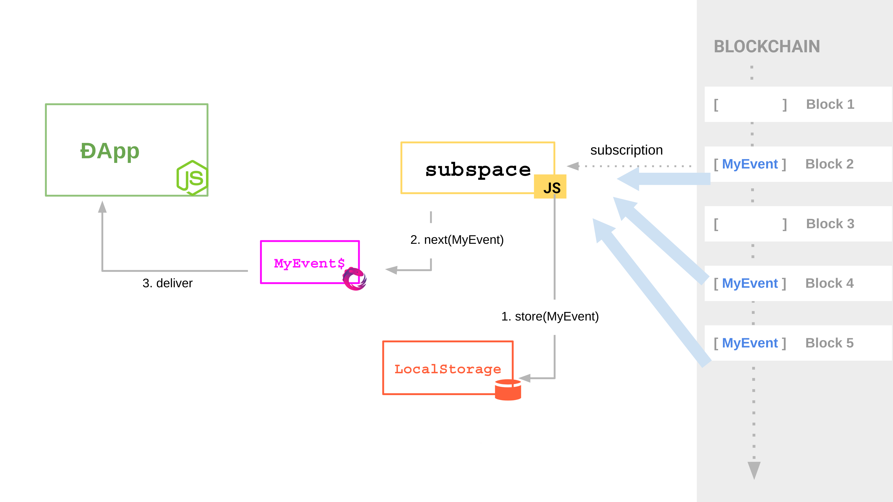
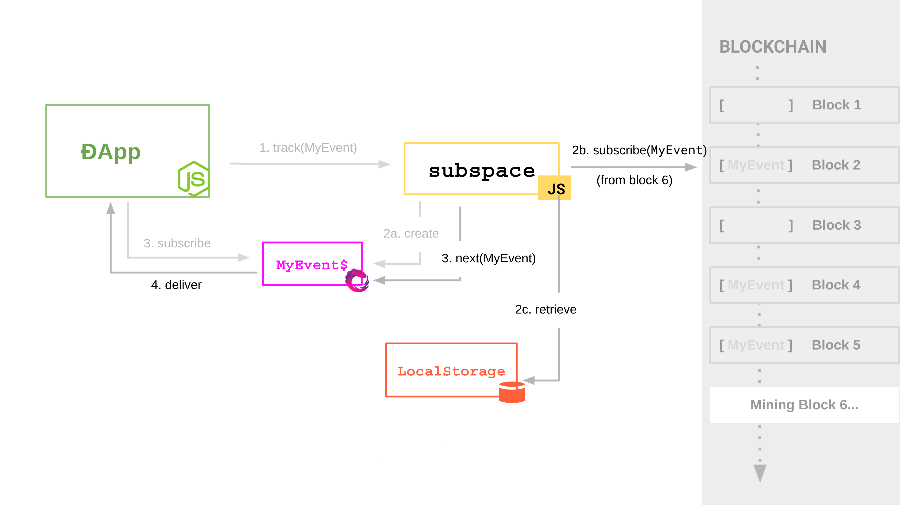
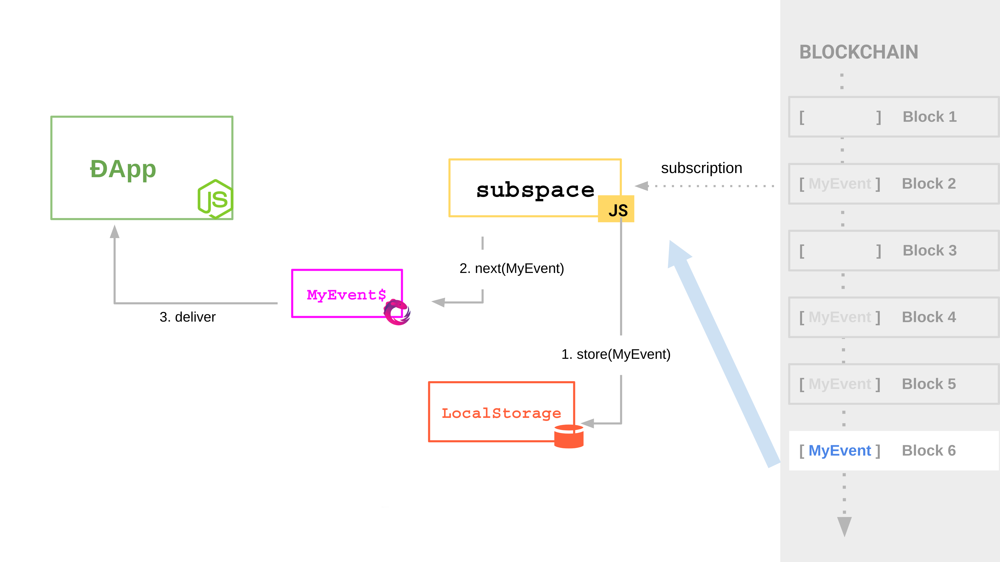

# How it works?

### Setup

1. A ÐApp requests `Subspace` to track an event, property, or balance.
2. `Subspace` creates a observable for that event, and a web3 subscription to retrieve events from the chain
3. The ÐApp subscribes to the observable to receive events.

### Receiving events

Depending on the filter parameters used to track the events, once an event is found, it is stored in `localStorage` and it is also pushed to the observable which delivers it to the ÐApp subscription.

### Usage after the first setup and Tracking already known events and 
After restarting the ÐApp, either by executing it again in case of a console application or refreshing the browser the behavior of `Subspace` will change: 

1. The Dapp will request `Subspace` to track an event it already knows, creating an observable and subscription for that event
2. It will retrieve events that were previously stored in localStorage and deliver them to the DApp subscription, avoiding having to query the chain for the old events again. 

The web3 subscription created previously will start from the last known block instead of beginning from scratch. New events will be delivered normally from this step
